# Wearmony

**Try it on together.**

Wearmony is a group virtual try-on. Everyone going to the same event (a prom, a play, a wedding, a family photo) tries an outfit, a lip color and a hair color on their own photo, and the group sees itself together in one frame, with a color-harmony check and a shared budget, before anyone spends money.

Built for the *YouCam API Skin AI & eCommerce VTO Hackathon*.

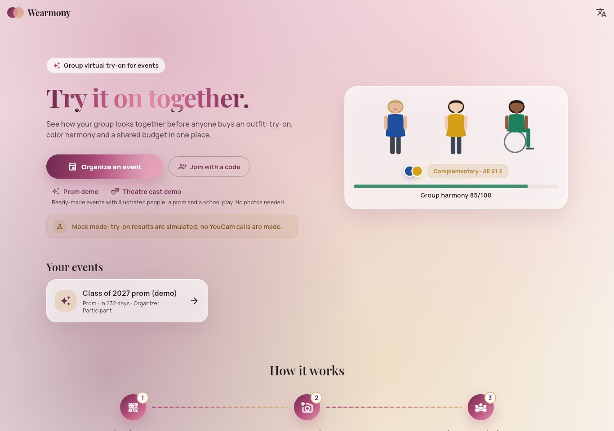

- Web app: see [Deploy](docs/deploy.md) (GitHub Pages)
- Android: APK on the Releases page
- Runs fully offline in mock mode: no accounts or API keys needed ([Run locally](#run-locally))
- Two ready-made demo events with illustrated people, a prom and a school theatre cast, each with a short guided tour

## Problem

Every virtual try-on product is built for one person, but event outfits are decided together. What matters is how people look *next to each other*. At Bulgarian high-school proms (абитуриентски бал), a major family expense, couples and friend groups coordinate colors by trading screenshots and discover clashes on the night itself: two almost-identical pinks read as a mistake in every photo.

Try-on is also usually tested on standing models. The YouCam AI Clothes documentation itself asks for a person "facing forward in a standing position (no sitting or crouching)". Wearmony is built to work for seated people, such as wheelchair users, and to measure and publish how well it does.

## What it does

| Role | What they get |
| --- | --- |
| **Organizer** (web) | Creates an event from a template (prom, theatre cast, group photo), invites people with a code, link or QR code, manages the catalogue, sees the group board with budget and harmony warnings, and can delete the event with all its media. |
| **Participant** (Android or web) | Joins with a code, gives consent, uploads one photo (standing or seated) with a quality check, builds a look (outfit + lip color + hair color) with a running total, tries it on, sees themselves next to their partner, locks the final look, deletes their data at any time. |
| **Vendor** (no account) | A hairdresser opens a read-only, expiring link with the chosen hair color and the "before" photo. A shop or costume keeper gets a catalogue link to add items. |

The group board shows everyone side by side ("7 of 8 rendered"), per-person and total budget, and the weakest color pair in plain words. On top of that:

- **Showcase**: from the group board, four ways to present the group: a virtual runway, the group photo, a color moodboard and a lookbook.
- **Virtual runway**: participants walk a lit catwalk one at a time, as partners or in a finale lineup, and a near-miss can be fixed right on stage.
- **Color moodboard**: the group's outfit colors on a hue wheel with one chord per pair (green for a match, pulsing red for a near-miss, gold for complementary), swatch cards with their hex codes, the warm and cool balance, and a PNG export.
- **Lookbook**: four editorial spreads (cover, partners, the whole collection with prices, the color story), each saved as an image.
- **Confetti** when a near-miss is fixed or a look is locked.
- **How to fix it**: for a near-miss, the harmony engine tries every catalogue item on the people involved and keeps only the swaps that remove the clash, each with its new relation, the group score before and after, and the price difference. A participant switches with one tap; a suggestion for someone else can be copied and sent to them.
- **Group photo**: everyone's current look in one frame on a painted backdrop (ballroom, stage, garden or studio), partners side by side, with the harmony score and the group's palette. Saved as a PNG on the web, shared from Android, and it keeps the labels that say what is simulated.
- **Harmony map**: the group as a ring of outfit colors with one line per pair, colored by relation; the weakest near-miss pulses.
- **Budget and readiness**: spending split into outfits, lip colors and hair colors, each person against the per-person cap, and who still needs a photo, a look, a preview or a lock, with a reminder to paste into the group chat.
- **Compare looks**: every look a participant has previewed on their photo stays one tap away; two can be compared with a slider, and an earlier one worn again at no cost because each step is cached.
- **Recent activity**: who joined, chose or locked a look, and who tried theirs on, as a timeline that updates while the group works.
- **Dress code**: the organizer picks up to four colors; each outfit is placed in, close to or outside the dress code by its distance to the nearest color, shown on every card, as a group stat and in the harmony report.
- **Person details**: tapping someone on the board opens their look in detail, with prices and how their colors sit next to each other person.
- **Event day**: an optional date with a countdown in the event header.

English and Bulgarian throughout.

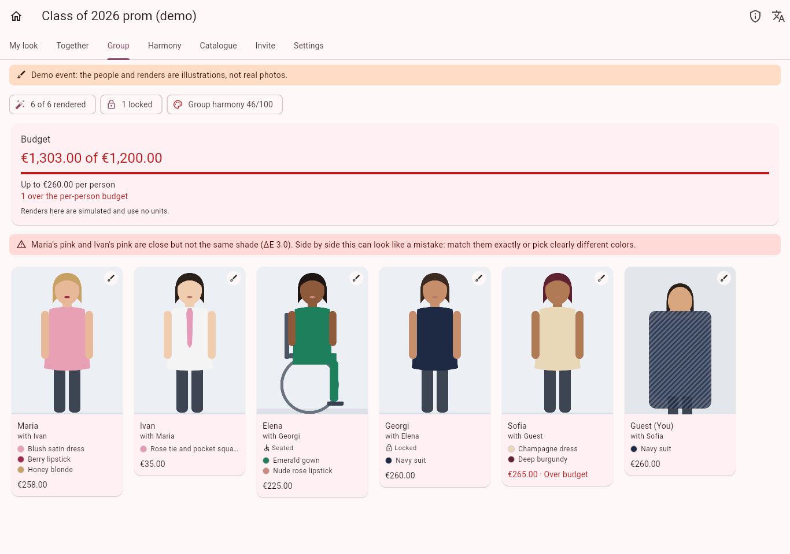

**How to fix it**: in the demo you are Sofia's partner, in a sand tie that nearly matches her champagne dress. The catalogue swaps that fix it are listed with what each would change; the exact match is one tap away.

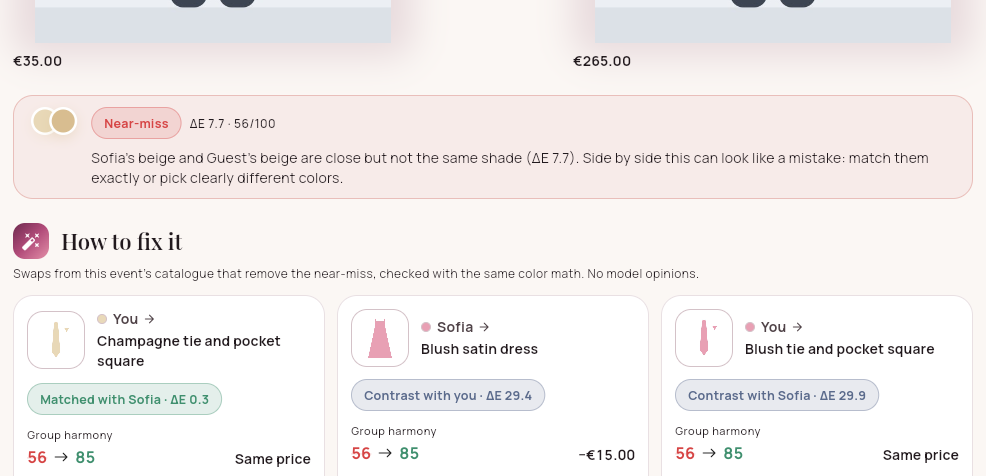

**Group photo**: everyone's current look in one frame, ready to save or share.

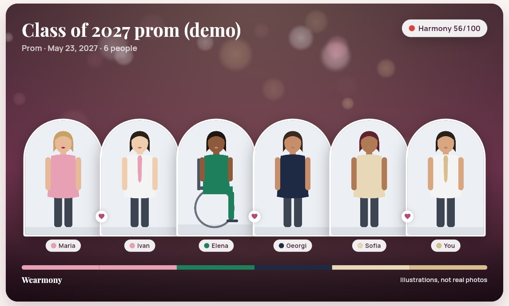

**Same engine, another event**: the theatre cast demo finds two nearly matching teal doublets, and Mercutio is played from a wheelchair.

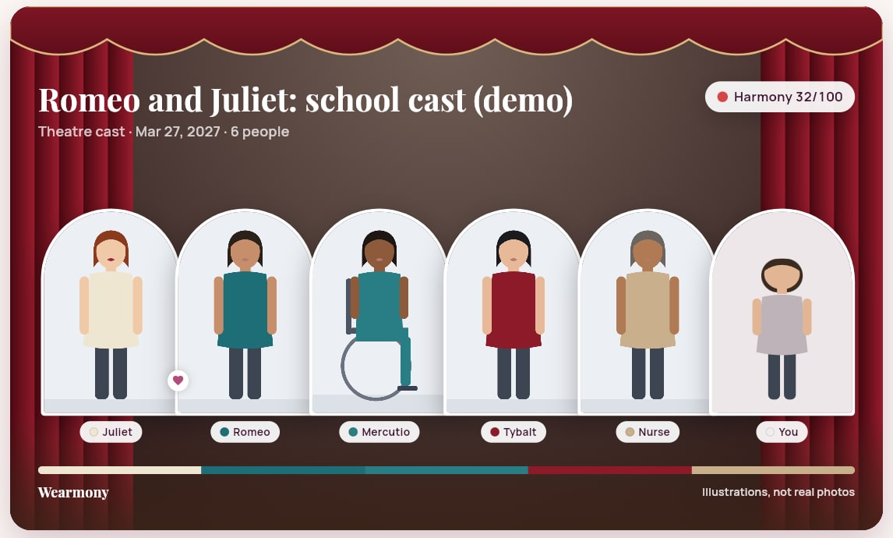

| Guided tour of a demo | Compare two looks |
| --- | --- |
| 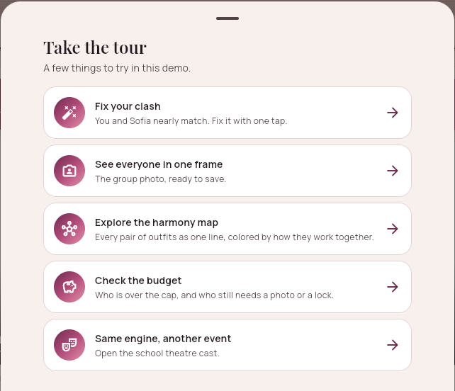 | 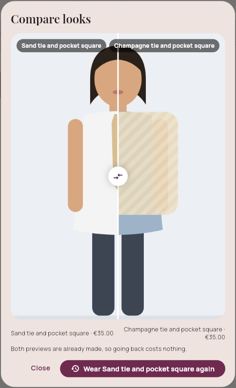 |

| My look: before/after slider | Together | Hairdresser link | Bulgarian |
| --- | --- | --- | --- |
| 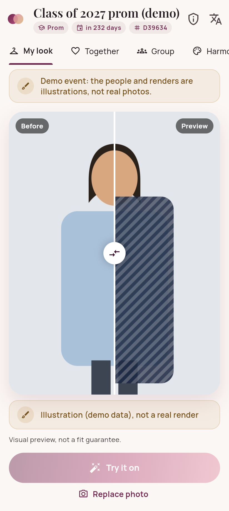 | 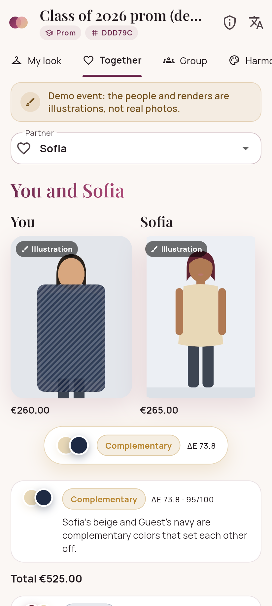 | 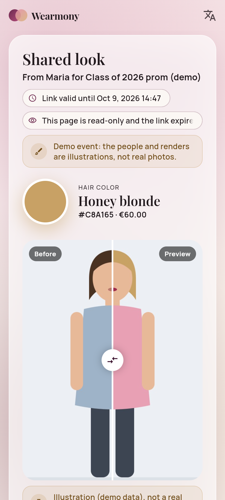 | 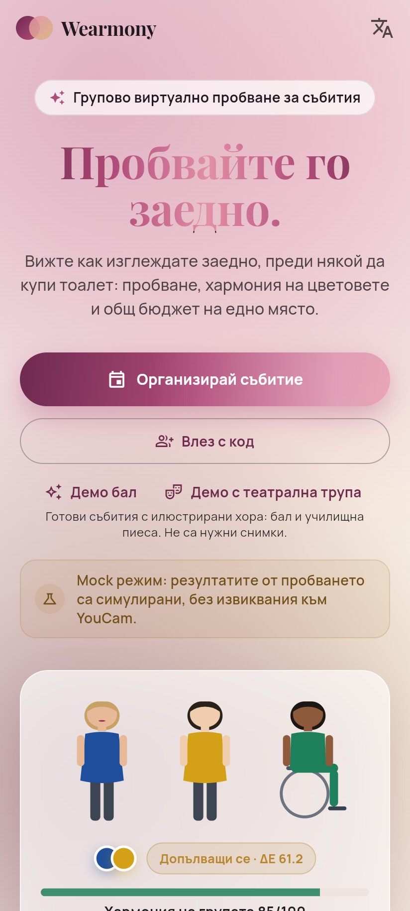 |

| Harmony report | Harmony map | Budget and readiness |
| --- | --- | --- |
| 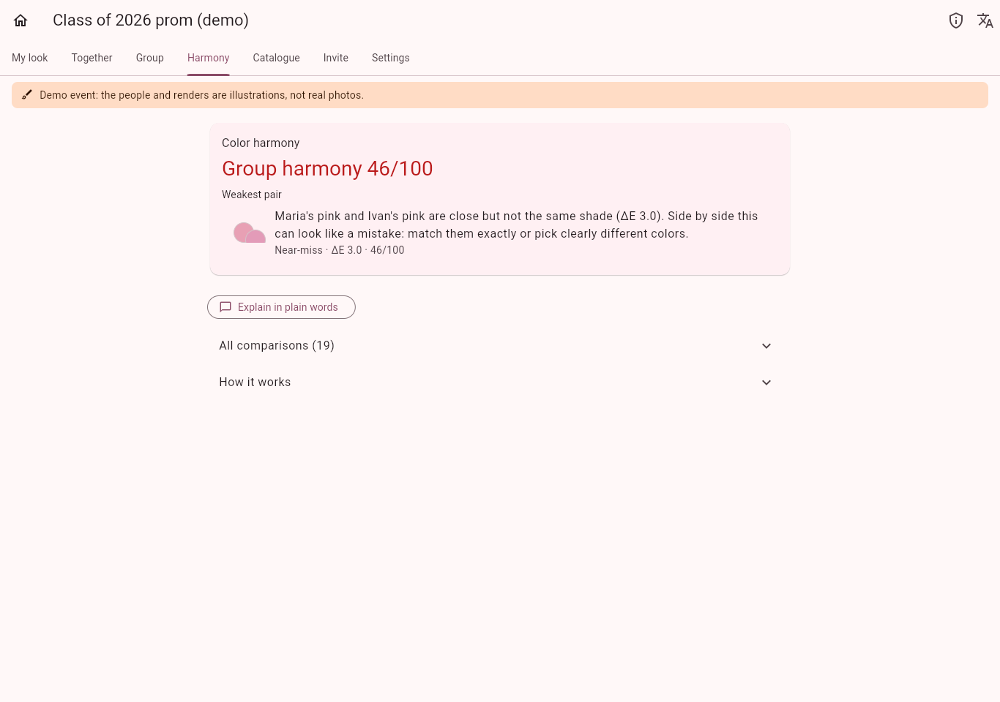 | 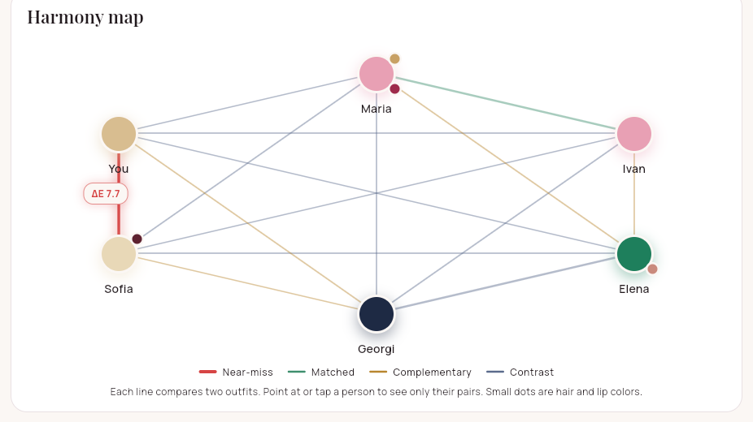 | 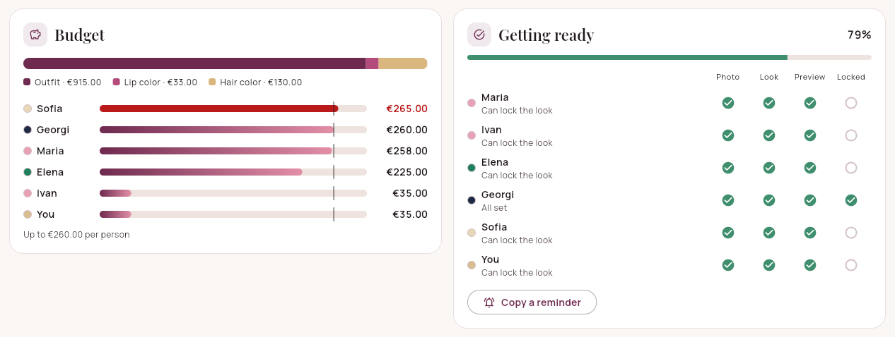 |

| Catalogue with extracted colors | Invite with QR code | Dark mode |
| --- | --- | --- |
| 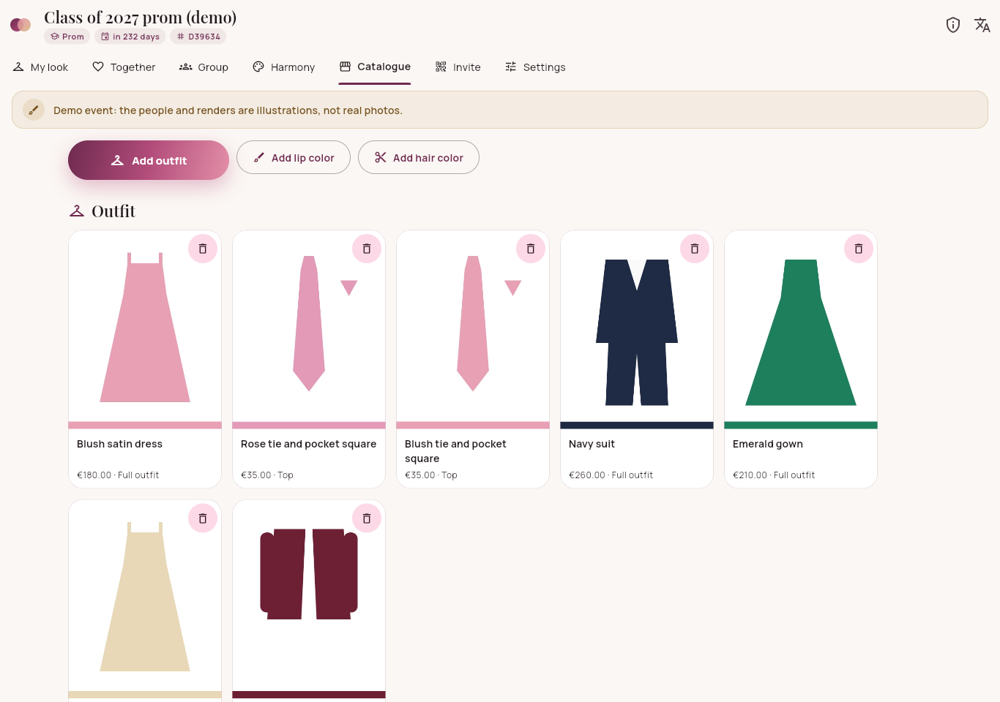 | 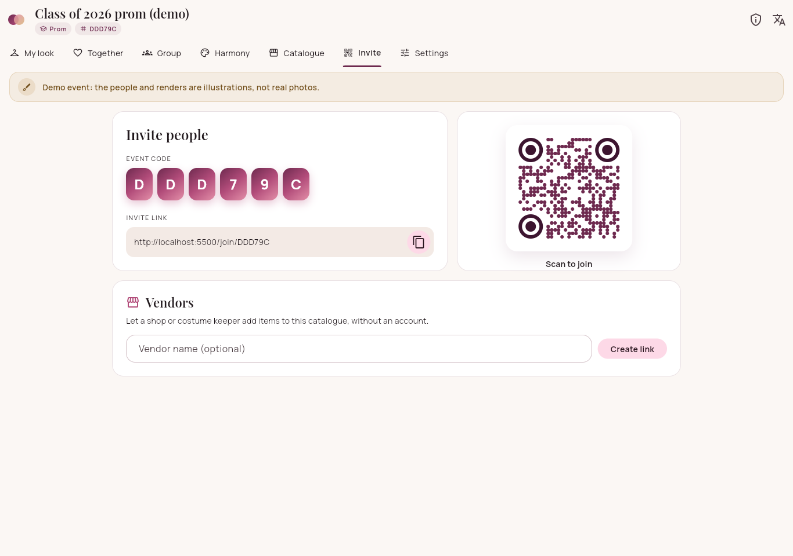 | 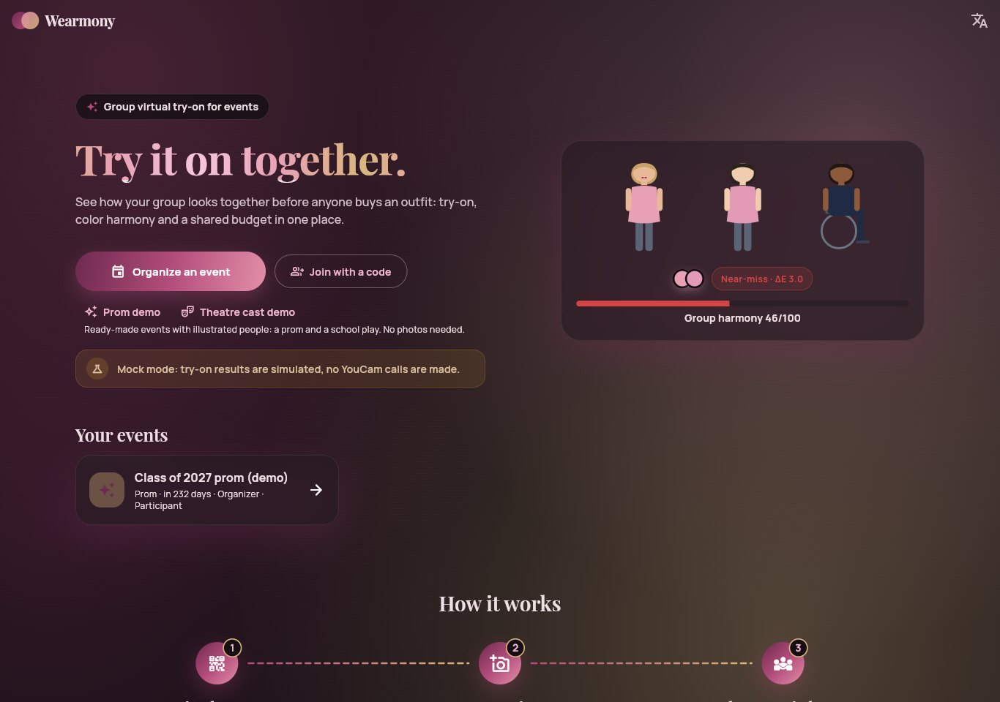 |

Screenshots come from the built-in demo events: the people are illustrations, not photos, and their renders are labeled as demo data.

The interface uses Playfair Display and Manrope (both with Cyrillic), a plum, rose and champagne palette with light and dark themes, and motion throughout: a drifting aurora backdrop, staggered reveals, a before/after wipe on each try-on, a scanning beam while a render runs, an animated harmony gauge and harmony map, a 3D tilt and cursor spotlight on cards, a pulsing glow on a near-miss, a celebration when the last clash is fixed, and sparkles when a look is locked. All motion switches off when the system asks for reduced motion.

## How YouCam is used

All YouCam paths and payloads live in one module: [`api/youcam/`](api/youcam). Nothing else touches HTTP details.

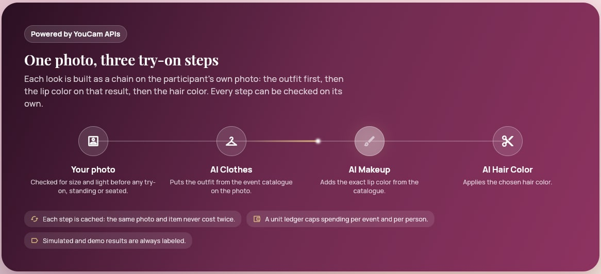

| Step | Endpoint | Used for |
| --- | --- | --- |
| Register file | `POST /s2s/v2.0/file` | Participant photo, catalogue garment image, previous step's result |
| Upload | `PUT` presigned URL from the step above | Image bytes (rotated, resized, stripped of metadata first) |
| Apparel try-on | `POST /s2s/v2.0/task/cloth-v4` with `src_file_id`, `ref_file_id`, `garment_category` | Outfit on the participant's photo (2 units) |
| Lip color | `POST /s2s/v2.0/task/makeup-vto` with a `lip_color` effect | Exact lipstick color from the catalogue (1 unit) |
| Hair color | `POST /s2s/v2.0/task/hair-color` with a custom palette | Exact hair color from the catalogue (1 unit) |
| Poll | `GET /s2s/v2.0/task/{feature}/{task_id}` | Status, result URL (valid 2 hours) and engine error codes |
| Budget | `GET /s2s/v1.0/client/credit`, `GET /s2s/v2.0/credit/feature-cost` | Balance check before every paid call; live prices |

A look renders as a chain: outfit on the photo, lip color on that result, hair color on that one. Engineering around the API:

- **Content-hash cache**: every step is keyed by a hash of its input image, item and parameters. The same photo with the same item never costs twice, and a changed look reuses the finished steps.
- **Unit ledger**: hard caps per event and per participant, plus a live balance check and an optional account reserve, before every paid call. When the budget runs out the look is kept and the app says so.
- **Seated fallback**: if a full-length outfit fails for a seated participant, the engine is retried once with upper-body framing.
- **Silent-failure detection**: a render that is almost identical to the photo is flagged ("the outfit may not have been applied"), and a render whose colors drifted from the catalogue gets a "check this render" note. Neither changes a harmony score.
- **Serverless-friendly polling**: the client polls the backend, which checks YouCam at most every 8 seconds per task (the API allows 250 requests per 5 minutes).
- **Mock mode** (`YOUCAM_MODE=mock`): the whole app runs with zero YouCam calls, and every simulated result is labeled as such.
- **Fixtures**: real responses captured from the account (redacted) and the documented examples, kept apart, back the client tests.

Details: [docs/youcam.md](docs/youcam.md).

## Harmony method

Deterministic and explainable; no model opinions.

1. **Garment colors** come from the catalogue image, not from the render: background removed (transparency, or a uniform border color), then k-means clustering in CIELAB with a fixed seed, similar clusters merged, small accents dropped. Lip and hair colors are exact values from the catalogue.
2. **Every pair** of participants' outfit colors, and each person's lip and hair color against their own outfit, is compared with **CIEDE2000** (verified against all 34 published Sharma et al. test pairs):

| ΔE00 | Relation | Meaning |
| --- | --- | --- |
| under 2 | matched | reads as the same color, intentional |
| 2 to 8 | **near-miss (warning)** | close but not equal: reads as a mistake side by side |
| over 8, hues about opposite | complementary | the colors set each other off |
| over 8 otherwise | contrast | clearly different, reads as intentional |

3. The **group score is the weakest pair**, not an average, and names who is involved. Every finding comes with one plain sentence ("Sofia's beige and Guest's beige are close but not the same shade (ΔE 7.7)…").
4. **Fix suggestions** re-run the same engine with each catalogue item swapped in and keep only real fixes, ranked by near-misses left, budget, group score, same kind of garment, the result for the pair, and price.

All thresholds are in one commented file: [`api/harmony/config.ts`](api/harmony/config.ts). An optional Gemini summary can restate the results in plain words; it only sees the computed facts and never affects a score. Harmony is about colors only, never about bodies or skin. Details: [docs/harmony.md](docs/harmony.md).

## Inclusion results

The evaluation runs the same garments on standing and seated photos of consenting adults and records success, silent failures, identity drift (human-reviewed) and latency. The numbers are published unedited on the app's inclusion page and in [`eval/results/`](eval/results).

**Current status: not measured yet.** The runner ([`eval/kill-tests/run.ts`](eval/kill-tests/run.ts)) is ready; the table appears here after the first run. No number in this project is estimated.

## Limits and honesty

- Try-on is a visual preview, not a fit guarantee.
- The YouCam apparel engine is documented for standing people. Seated results are measured, not assumed.
- Dark or bulky clothing on the photo can make apparel try-on fail silently; the photo check warns about it and the render check flags it.
- For lower-body garments YouCam supports worn-outfit photos, not standalone product shots.
- The demo event uses illustrated, fictional people; its renders are drawings, labeled as demo data. Mock-mode results are labeled as simulated.
- Harmony compares colors in catalogue photos under neutral assumptions; fabric, lighting and cameras change how colors look on the night.

## Privacy

- Participants must be adults and accept a consent screen before uploading a photo.
- Photos are resized, auto-rotated and **stripped of all metadata, including GPS location**, before storage and before anything is sent to YouCam.
- Media lives in a private bucket and is only reachable through signed URLs that expire after an hour. All database tables have row-level security with no public policies; only the backend reads them.
- Photos are visible only to members of the event. Vendor links are read-only, scoped, expiring, and only a hash of the token is stored.
- Participants can delete their photo, leave an event, or delete their data in every event at once. The organizer can delete the event with all its media.
- No "flattering" or body-related language anywhere, including the optional AI summary.

## Architecture

```
Flutter app (web + Android)
   │  HTTPS, bearer token (Supabase Auth or dev token)
   ▼
Backend on Vercel (TypeScript, Hono, one serverless function)
   ├── youcam/    the only module that talks to YouCam (+ mock provider)
   ├── harmony/   CIELAB, CIEDE2000, color extraction, rules, photo and render checks
   ├── render/    look render chain with content-hash cache
   ├── ledger/    unit caps and balance checks
   ├── data/      repository: in-memory or Supabase Postgres
   └── storage/   media: in-memory or private Supabase Storage bucket
```

```
app/          Flutter client (web + Android), English and Bulgarian
api/          Backend (Vercel project root)
  api/        the single Vercel function entry; routes live in http/
supabase/     database schema (SQL migration)
fixtures/     captured and documented YouCam responses used by tests
eval/         inclusion evaluation runner and published results
docs/         method notes and deployment guide
```

## Run locally

Requirements: Node 22 and Flutter 3.35+. No accounts: the backend defaults to in-memory data and simulated try-on.

```bash
cd api
npm install
npm test                 # 159 tests: CIEDE2000, extraction, rules, API flows, ledger, YouCam client
npm run dev              # http://localhost:8787/api/health

cd ../app                # second terminal
flutter pub get
flutter test             # 34 tests: widgets, navigation, runway, moodboard, lookbook, accessibility
flutter run -d chrome    # then press "Open the demo event"
```

Android emulator: `flutter run --dart-define=API_BASE_URL=http://10.0.2.2:8787`.

Configuration lives in `.env` (see [`.env.example`](.env.example)): `YOUCAM_MODE=live` for real renders, `DATA_MODE=supabase` for persistent data. Deployment: [docs/deploy.md](docs/deploy.md).

## License

[MIT](LICENSE)
